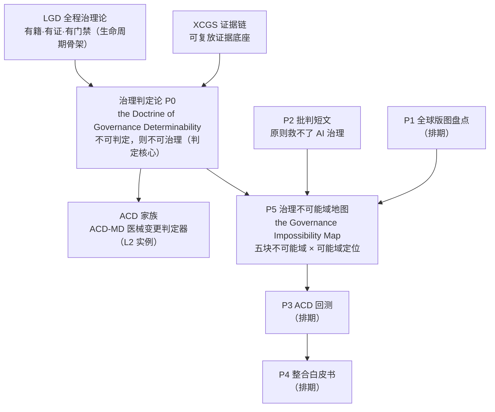

# Working Papers · 治理线论文矩阵（P0–P5）

> SynomosAI Governance Line · 论文矩阵公开工作稿入口
> 状态：working papers（工作稿，未提交期刊/预印本仓库；SSRN/期刊投稿进行中）
> 版权 © SynomosAI（2026）。AS IS。所引第三方定理归其各自权利人所有。

---

## 族谱 DAG（理论栈 → 论文矩阵）



## 本目录文件

| 文件 | 矩阵位 | 状态 | 一句话 |
|---|---|---|---|
| [P0-governance-determinability-doctrine-v1.2-zh.md](P0-governance-determinability-doctrine-v1.2-zh.md) | 基础工作稿 | v1.1（内部拍板） | 治理判定论：判据可形式化谱系 L0–L4、判定债务、悬置态、六命题附可证伪条件 |
| [P2-critique-principles-cannot-save-ai-governance-v1.0-zh-en.md](P2-critique-principles-cannot-save-ai-governance-v1.0-zh-en.md) | P2 批判 | v1.0 中英双版 | 原则层趋同不等于治理效力；批判型短文（引用大户"批判姿势"） |
| [P5-governance-impossibility-map-v0.3-zh.md](P5-governance-impossibility-map-v0.3-zh.md) | P5 地图 | v0.2（2026-09-08） | 五块不可能域（哲学/可解释性/判定/责任/授权-观测）整合图 + 可能域定位；英文版备稿中 |

## 撞车与命名纪律（诚实声明）

- P5 命名 "governance impossibility map"：OpenAlex 标题级治理语境 0 占用（2026-09-08 复扫）；全文不使用缩写指代本地图
- P0 核心词 "determination debt"：0 占用；"governance determinability" 标题级无实质占用
- 论文级撞车：零（两篇定理文献引用者各 1 且均非地图型，2026-09-08 复扫）

## 引用格式

```bibtex
@techreport{synomosai2026p5,
  title  = {The Governance Impossibility Map (Working Paper v0.2, Chinese)},
  author = {{SynomosAI}},
  year   = {2026},
  note   = {Working paper, not peer reviewed. Integrates Rao (2025), McCann (2026), Tibebu \& Shemtaga (2026), Meyman (2026), Fernandez (2026), Zhu \& Leonard (2026).}
}
```

## 相关入口

- 理论栈总览：[README.md](../README.md) ｜ 速查页：[docs/theories/](../docs/theories/) ｜ 概念定义汇编：[docs/doctrine-concepts.md](../docs/doctrine-concepts.md)
- CITE.md · LICENSE · CHANGELOG 见仓根目录
